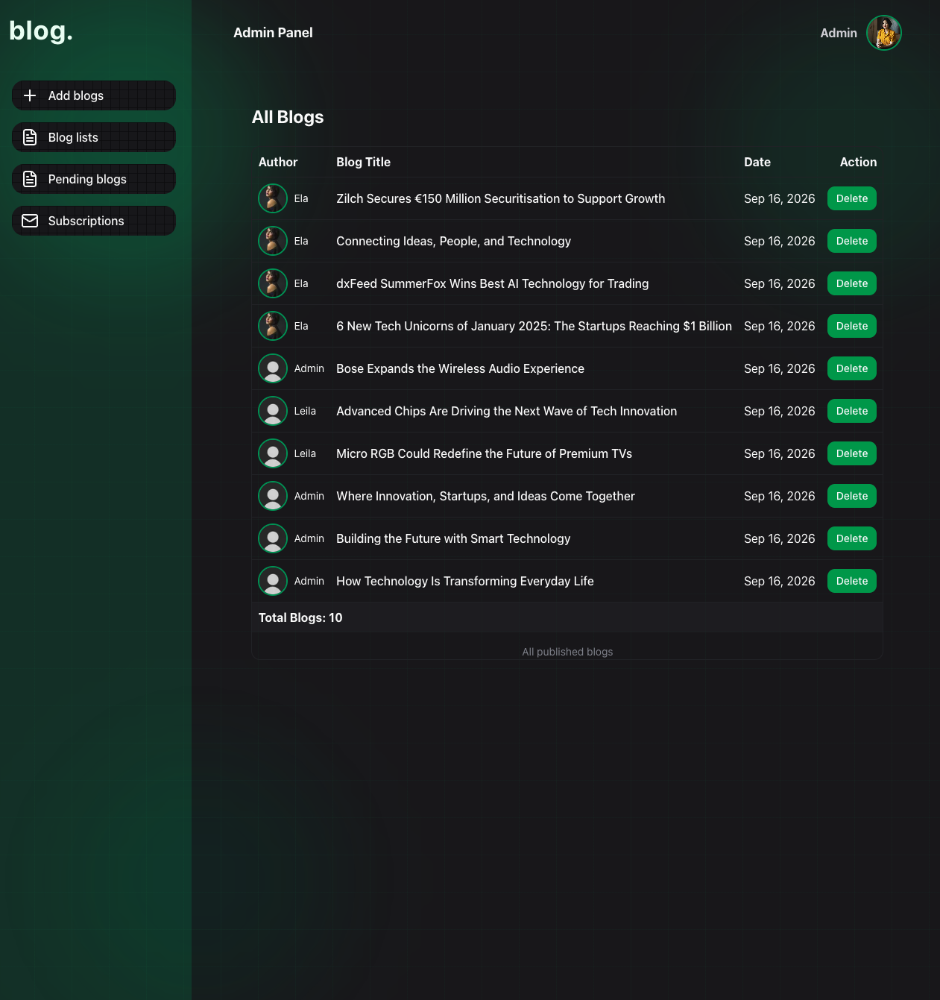
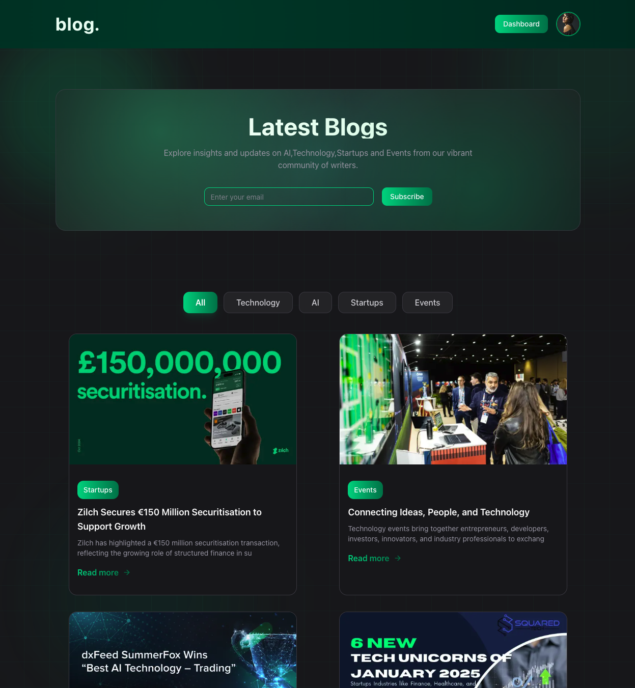
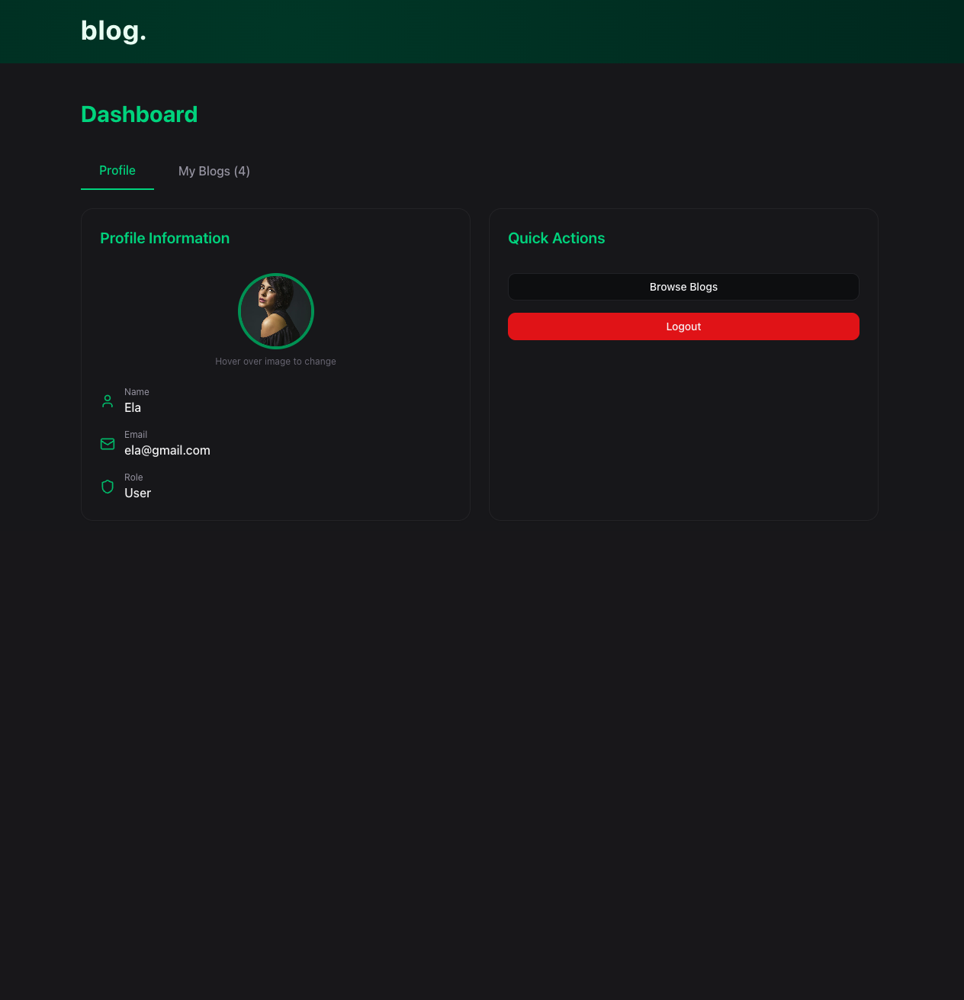
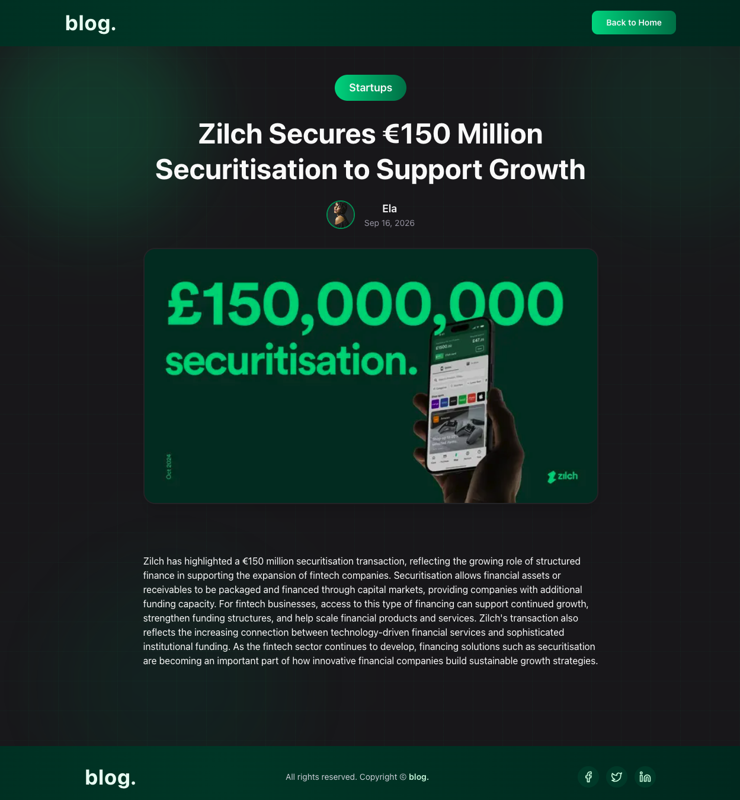
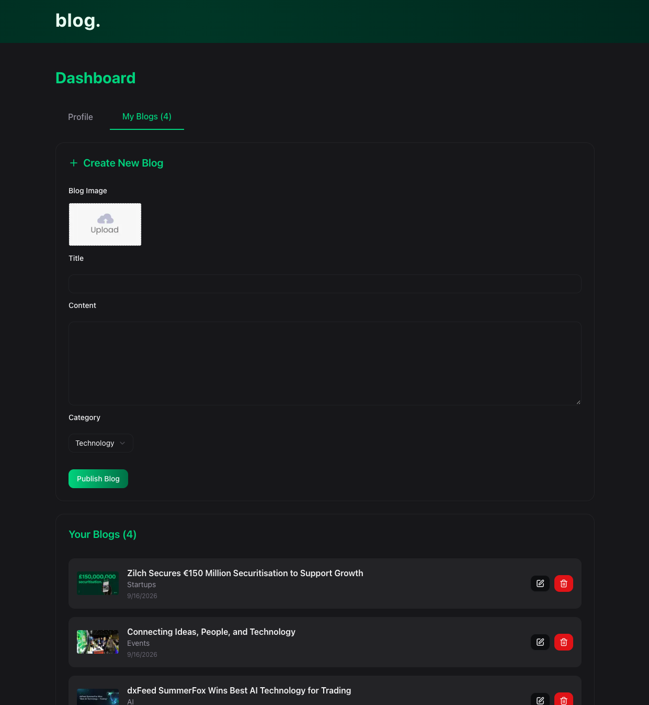
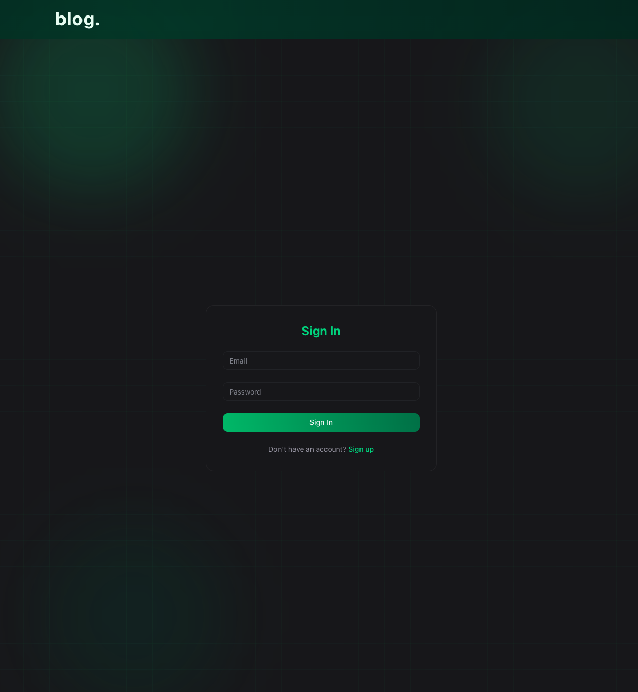

# 📝 Modern Blog Platform – Next.js Blog App

A modern, full-stack Blog Application built with Next.js.
Admins and users can manage blog content through a clean, responsive, and role-based interface.

## 🚀 Live Demo

**[View Live Demo](https://blog-abdulla.vercel.app/)** 🔗


## ✨ Features

- 🔐 Admin & user authentication
- 👥 Role-based dashboards
- 📝 Blog creation and management
- 📄 Blog detail pages
- 🗄️ MongoDB database
- ⚡ Mongoose ODM
- 🖼️ Cloudinary image upload & management
- 📱 Responsive design
- 🎨 shadcn/ui components
- 🔔 Toast notifications
- ✅ Form validation with Zod


## 🛠️ Tech Stack

- **Framework:** Next.js 16
- **UI:** React 19
- **Styling:** Tailwind CSS v4
- **Components:** shadcn/ui
- **Database:** MongoDB
- **ODM:** Mongoose
- **Authentication:** JWT (jsonwebtoken)
- **Password Hashing:** bcryptjs
- **API Requests:** Axios
- **Form Handling:** React Hook Form
- **Validation:** Zod
- **UI Components:** Radix UI
- **Icons:** Lucide React
- **Image Management:** Cloudinary
- **Notifications:** React Toastify
- **Deployment:** Vercel

  ## 📸 Screenshots

### Admin Panel


### Homepage


### Dashboard


### Blog Detail


### Create Blog Page



### Sign In


## 🛠️ Scripts

```bash
npm run dev     # Start development server
npm run build   # Build for production
npm run start   # Start production server
npm run lint    # Run ESLint
```

---

## 📄 License

This project is for **educational and portfolio purposes**.

---

